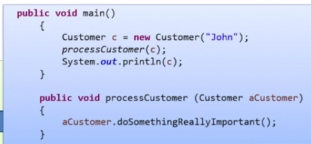
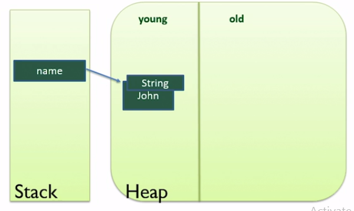
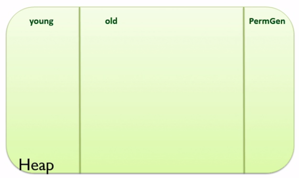

# Why memory is important in Java:

## How memory works in Java:

Java virtual machine is incredibly complicated and as Java developer we don’t need to understand exactly how it operates.

### The Stack

1. Every thread has its own stack.
2. Managed effectively by JVM.
3. Java knows exactly when data on stack can be destroyed.

### The Heap

1. Heap is used to store data that has longer lifetime than a single code block. Ex - Objects that needs to be shared across multiple methods.
2. Heap memory - All of the memory of your application except for the data on the stacks.
3. In an application there is one heap which is shared across all the threads and a number of stacks one for each thread.
4. All the threads, and in fact all code blocks in our application can potentially access the heap.
5. In Java all objects are stored on heap.
   > Note: In Java all objects are stored on the heap.

**Example**:

Variables are a reference to the object ( stored on stack )
Local variables are stored on the stack ( Primitive variables are entirely local ).

> Note: In java there is no way we can directly interact with heap memory.

**Example 2 for better understanding**:
**Code**

```
import java.util.ArrayList;
import java.util.List;

public class Memory {

    public static void main(String[] args) {

        List<String> myList = new ArrayList<String>();
        myList.add("one");
        myList.add("two");
        myList.add("three");
        printList(myList);

    }

    public static void printList(List<String> data) {
        String value = data.get(1);
        data.add("four");
        System.out.println(value);
    }

}

```


Explanation:

1. By creating myList object some memory is allocated in heap area and it is being reference through myList variable inside stack ( through which program execution will access the object).
2. Adding string again created string object inside heap area and it's reference is mentioned in the list object inside heap area. Note that there is no way we can directly access the string. We have to follow the link through myList stack variable.
3. In the printList method in the first line **value** variable will now store a direct reference to string **two**.
4. data is a local stack variable for printList method which can access List object area inside heap. Using this reference we are adding a new string **four**.
5. While printing value it will print two.

### Passing Variable by value:

#### How objects are passed:

It is pass by value only. For objects passed into methods, the REFERENCE to the object is passed by VALUE.

If you see above value and myList are 2 different variables.

> Note: Objects are not passed by reference.

**One Problematic example**

```
import java.util.ArrayList;
import java.util.List;
public class Customer {
    // details
    private String name;
    public Customer(String name) {
    }
    public void setName(String name) {
        this.name = name;
    }
}
public class Memory {
    public static void main(String[] args) {
        final Customer c = new Customer("Salman");
        // through final we can not change c to point to any other customer object
        // but we can change the name of customer. Think of the solution and let me know
        c.setName("Aamir");
    }
}
```

## Escaping Reference:

**Understanding through an example**:
Customer class:

```
public class Customer {
    private String name;

    public Customer(String name) {
        this.name = name;
    }
    public String getName() {
        return name;
    }
    public void setName(String name) {
        this.name = name;
    }
}

```

CustomerRecord Class which will contain an escaping reference:

```
import java.util.HashMap;
import java.util.Map;

public class CustomerRecord {

    private Map<String, Customer> records;
    public CustomerRecord() {
        this.records = new HashMap<String, Customer>();
    }
    public void addCustomer(Customer c) {
        this.records.put(c.getName(), c);
    }
    // This will return Escaping Reference
    public Map<String, Customer> getCustomers() {
        return this.records;
    }
}
```

Main class:

```
import java.util.ArrayList;
import java.util.List;
import java.util.Map;
public class Memory {

    public static void main(String[] args) {

        CustomerRecord r = new CustomerRecord();
        Map<String, Customer> myCustomer = r.getCustomers();

        // See the below problem. If we get reference to the original map we can practically do any operation, which is not right
        myCustomer.clear();
    }
}
```

**Solution of Escaping reference ( taking reference as above exaple )**:

**Method 1 ( Good solution )** -> Return new copy of object in place of original object.

**Method 2 ( Elegant Solution )** -> Return immutable collection. Java allows us to return immutable collection.
Collections.unmodifyableMap
Collections.unModifyableList

`return Collections.unmodifyableMap(this.record)`

**Method 3 ( Removing Escaping Reference using Interface )**:
CustomerReadOnly Interface

```
public interface CustomerReadOnly {
    String getName();
}
```

Customer Class

```
public class Customer implements CustomerReadOnly {
    private String name;

    public Customer(String name) {
        this.name = name;
    }

    @Override
    public String getName() {
        return name;
    }

    public void setName(String name) {
        this.name = name;
    }
}

```

CustomerRecord Class

```
import java.util.Collections;
import java.util.HashMap;
import java.util.Map;

public class CustomerRecord {

    private Map<String, Customer> records;
    public CustomerRecord() {
        this.records = new HashMap<String, Customer>();
    }
    public void addCustomer(Customer c) {
        this.records.put(c.getName(), c);
    }
    // removing escaping reference
    public Map<String, Customer> getCustomers() {
        return Collections.unmodifiableMap(this.records);
    }
    // removing escaping reference
    public CustomerReadOnly getCustomerByName(String name) {
        return this.records.get(name);
    }
}
```

Main class

```
import java.util.ArrayList;
import java.util.List;
import java.util.Map;
public class Memory {
    public static void main(String[] args) {
        CustomerRecord r = new CustomerRecord();
        Map<String, Customer> myCustomer = r.getCustomers();
        // uncomment below line to see this will be a compile time error now
//        Customer c = r.getCustomerByName("Salman");
        CustomerReadOnly c = r.getCustomerByName("Salman");
    }
}
```

## String Pool

JVM is designed in such a way that if more than 2 string is required with the same content then it actually creates one string inside the string pool. String pool is a special memory location in the Heap of JVM and it gives reference to every other place where that string is rwquired. In java we call these type of strings which is made in String pool **internalized string**.
Ex - `String three = new Integer(3).toString().intern()`

## Garbage Collection:

It's worth understanding how garbage collector works. As with this knowledge you can write code that avoids memory leaks. Or learn about the application's memory usage and the effectiveness of the garbage collector. So with this knowledge we will be able to detect and fix potential memory leaks.

The stack is very efficient, as soon as closing curly bracket reaches it pops variable off the stack that were created within the scope of the code block that's being exited.

Problem with stack is its scope is very tight. Its based on code blocks. Often, we want to an object to live for a longer period of time than its enclosing scope. That is when we want to share objects between code blocks.

Ex:

If Java had put the customer on the stack, it would have become out of scope and therefore invisible in the second method. Because we are passing reference of same object.
So the fact that Java creates the customer object on the heap means its able to be shared. In above case with the second method.

So life of variable in Heap is variable - **Some will live a little and some of them lives very long.**

In C/C++ while you create your object there is a choice you can make to put the created object either on stack or on heap.
But Java does not give you this choice. Rather it allocates all objects in heap area. The goal was to provide a simple and clean way of doing things. ( This was back in 1990s, now current JVMs are very efficient and puts objects either on stack/heap based on the requirement. It does not give user to make decision on where to store object. )

### Garbage Eligibility:

**In other language you must state when an object is no longer needed by calling a method like free().**

Object that are not freed continue to consume memory. This is a "memory leak"

**Java avoids memory leaks by**:
• **Running on a Virtual Machine** ( When you call new keyword in java to create an object, you are not taking memory from OS but memory is acquired by the VM. VM is another computer program written on C. This C program will control the request for memory for objects from the OS and it controls the freeing of memory when objects are no longer needed. )
• **Adopts a Garbage Collection strategy** - The idea of GC is that programmers ask for an objects to be allocated on heap, but do not need to free them when they are finished with. Instead, an automatic process analyzes the heap and aims to work out which objects are no longer needed. And any unneeded objects can be deleted. Rule is - Any object on the heap which can not be reached through a reference from the stack is eligible for garbage collection.

**gc** - **GC method suggests the JVM to run the garbage collection process**. Its going to tell VM to run garbage collection but there is no guarantee that the virtual machine will do.

**Finalize method** - When an object is actually garbage collected, i.e. when the garbage collection process physically removes the object from the heap, rather than when it becomes eligible for garbage collection,at that point Java runs its finalize method.

The only job of garbage collector is to keep your heap nice and neat. There might be a chance it will not run garbage collection process.

### Understanding what soft leaks are:

Java avoid memory leaks by: 1. Running on a Virtual Machine 2. Adopts a Garbage Collection strategy
**Soft leak** - An object is referenced on the stack even though it will never be used.

### Generational Garbage Collection:

GC uses a clever mechanism - Rather than searching for all the objects to remove instead the garbage collector looks for all the objects that need to be retained and it rescues them. Algorithm used is **"Mark and Sweep"** process.
2 stage - 1 stage is marking and 2nd stage is sweeping.

In the marking stage, the program's execution is first paused. This is sometimes called a stop the world event. Marking does not work properly if there are any threads that are still running. So all the threads in the application are paused. The garbage collector then checks every single live reference. It is easy to do. It simply looks at every variable on the stack and follows its reference. The object that it finds at the end of the reference is marked as live.

The memory occupied by those objects not marked of in use, can then be freed up. And finally, the objects that are being kept and finally, the objects that are being kept, are moved into a single contiguous block of memory the stops the heap from becoming fragmented.

### Generational Garbage Collection:

To solve above problem ( in which GC runs after stopping every thread )
• Most object in Java live for a very short period of time.
• If an object survives it is most likely to live forever.

The surviving objects are then copied to Old section of Heap. The Garbage collection of young generation is known as minor collection.

Major collection - If old heap area got filled. Very rare. It is slower than minor collection.

### PermGen / Metaspace:


The objects in permgen is never garbage collected.
If Permgen runs out of space your application is going to crash. The only way to avoid this problem is through increasing size of PermGen heap if it runs out of memory.

Every time we create a class, the meta data for that class is placed into PermGen.

2 types of object that go into Permgen: 1. Internalized strings - That is strings which are placed into pool for reuse.

> Note:
> If you are running a server application ( tomcat server ) that each time you redeploy your application if you make a small change to code and you deploy that version on the server, even though many of the classes won't have changed, a new complete set of meta data for all your classes is created in your PermGen and all the metadata related to previous deployment of your application is still in the PermGen but will never be referred to. So the only possible solution is stop the tom cat server and restart it each time your redeploy your new version of code to avoid the PermGen becoming full.

**From Java 7** -> internalized string was no longer stored on PermGen. This means internalized string will be part of old part of heap and can be garbage collected.

In **Java 8** they removed PermGen altogether. Instead they created something called MetaSpace. Which is where meta data of your classes are placed and it can be garbage collected.

> Note: MetaSpace is not part of heap,Instead it is allocate out of your computer's native memory so maximum available space for the MetaSpace is total available system memory.

## Tuning Virtual Machine:

By passing argument ( command line parameter ) - -Xmx -> set the maximum heap size
Normal defaul heap size is quarter of your computer's total memory.
If you are client then maximum default heap size is 256 MB

**-Xms** -> set the starting heap size ( when your application starts )
**-Xmx512m -Xms150m** -> max heap size 512 MB, starting heap size 150 MB
**-Xmx256k -Xms150k** -> max heap size 256 KB, starting heap size 150 KB

For changing size of PermGen
**-XX:MaxPermSize**
All these run time arguments are case sensitive.
Ex ->
**-XX:MaxPermSize=256M**
**-verbose:gc** -> print to the console when a garbage collection takes place

By default the young generation is set as 1/3rd of total heap size.

-Xmn -> set the size of the young generation
Ex -> -Xmn256m

If there is a chance that your application might crash, you can use below argument
**-XX:HeapDumpOnOutOfMemory** - creates a heap dump file

Useful Links -

1. https://docs.oracle.com/javase/8/docs/technotes/guides/vm/gctuning/
2. https://docs.oracle.com/javase/8/docs/technotes/guides/vm/gctuning/collectors.html#sthref27

**Oracle virtual machine has 3 types of collectors**:
• **Serial** - Uses single thread to perform all garbage collection work. **-XX:+UseSerialGC**
• **Parallel** - Performs garbage collection on young generation ( minor collection ). Multiple threads will be running to perform garbage collection process. **-XX:+UseParallelGC**
• **Mostly concurrent** - Closest we can get to real time garbage collection. That is where the application is not paused while the collection process happens. Actually that is not possible. Your application does need to be pause, but with this of GC. It only pauses application for marking of objects, but then resumes your application while sweep phase takes place. These are of 2 type:
○ Mark sweep collector - **-XX:+UseConcMarkSweepGC**
○ G one collector - **-XX:+UseG1GC**

Use **-XX:+PrintCommandLineFlags** to find out which is your default GC.
Run this command - **java -XX:+PrintCommandLineFlags**
