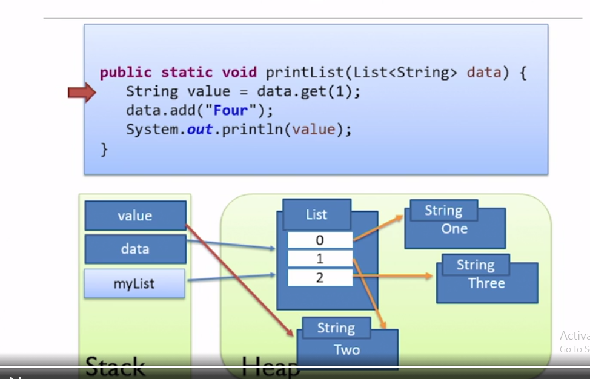
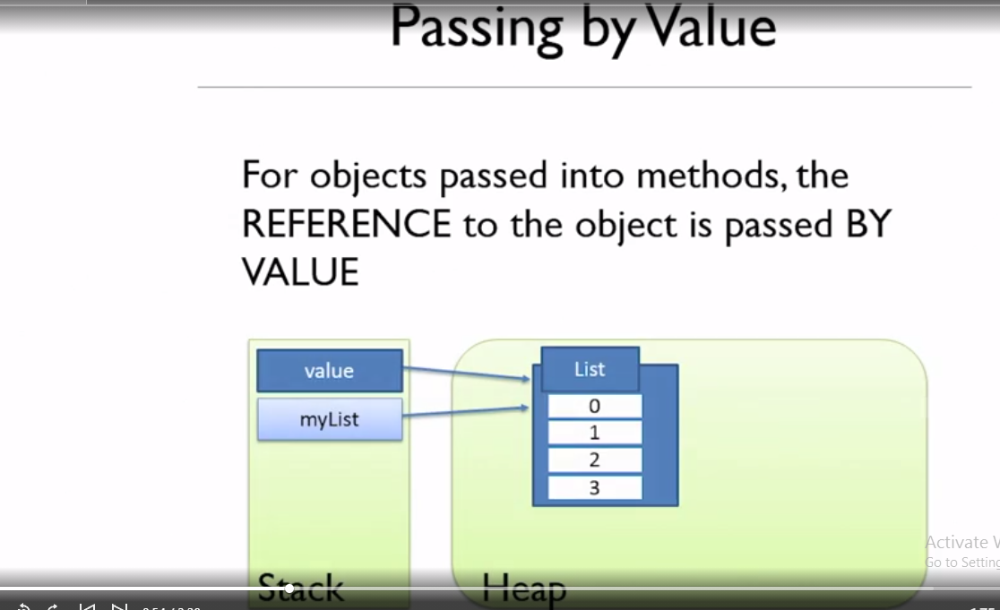

# Why memory is important in Java:

## How memory works in Java:

Java virtual machine is incredibly complicated and as Java developer we don’t need to understand exactly how it operates.

### The Stack

1. Every thread has its own stack.
2. Managed effectively by JVM.
3. Java knows exactly when data on stack can be destroyed.

### The Heap

1. Heap is used to store data that has longer lifetime than a single code block. Ex - Objects that needs to be shared across multiple methods.
2. Heap memory - All of the memory of your application except for the data on the stacks.
3. In an application there is one heap which is shared across all the threads and a number of stacks one for each thread.
4. All the threads, and in fact all code blocks in our application can potentially access the heap.
5. In Java all objects are stored on heap.
   > Note: In Java all objects are stored on the heap.

**Example**:

Variables are a reference to the object ( stored on stack )
Local variables are stored on the stack ( Primitive variables are entirely local ).

> Note: In java there is no way we can directly interact with heap memory.

**Example 2 for better understanding**:
**Code**

```
import java.util.ArrayList;
import java.util.List;

public class Memory {

    public static void main(String[] args) {

        List<String> myList = new ArrayList<String>();
        myList.add("one");
        myList.add("two");
        myList.add("three");
        printList(myList);

    }

    public static void printList(List<String> data) {
        String value = data.get(1);
        data.add("four");
        System.out.println(value);
    }

}

```


Explanation:

1. By creating myList object some memory is allocated in heap area and it is being reference through myList variable inside stack ( through which program execution will access the object).
2. Adding string again created string object inside heap area and it's reference is mentioned in the list object inside heap area. Note that there is no way we can directly access the string. We have to follow the link through myList stack variable.
3. In the printList method in the first line **value** variable will now store a direct reference to string **two**.
4. data is a local stack variable for printList method which can access List object area inside heap. Using this reference we are adding a new string **four**.
5. While printing value it will print two.

### Passing Variable by value:

#### How objects are passed:

It is pass by value only. For objects passed into methods, the REFERENCE to the object is passed by VALUE.

If you see above value and myList are 2 different variables.

> Note: Objects are not passed by reference.

**One Problematic example**

```
import java.util.ArrayList;
import java.util.List;
public class Customer {
    // details
    private String name;
    public Customer(String name) {
    }
    public void setName(String name) {
        this.name = name;
    }
}
public class Memory {
    public static void main(String[] args) {
        final Customer c = new Customer("Salman");
        // through final we can not change c to point to any other customer object
        // but we can change the name of customer. Think of the solution and let me know
        c.setName("Aamir");
    }
}
```

## Escaping Reference:

**Understanding through an example**:
Customer class:

```
public class Customer {
    private String name;

    public Customer(String name) {
        this.name = name;
    }
    public String getName() {
        return name;
    }
    public void setName(String name) {
        this.name = name;
    }
}

```

CustomerRecord Class which will contain an escaping reference:

```
import java.util.HashMap;
import java.util.Map;

public class CustomerRecord {

    private Map<String, Customer> records;
    public CustomerRecord() {
        this.records = new HashMap<String, Customer>();
    }
    public void addCustomer(Customer c) {
        this.records.put(c.getName(), c);
    }
    // This will return Escaping Reference
    public Map<String, Customer> getCustomers() {
        return this.records;
    }
}
```

Main class:

```
import java.util.ArrayList;
import java.util.List;
import java.util.Map;
public class Memory {

    public static void main(String[] args) {

        CustomerRecord r = new CustomerRecord();
        Map<String, Customer> myCustomer = r.getCustomers();

        // See the below problem. If we get reference to the original map we can practically do any operation, which is not right
        myCustomer.clear();
    }
}
```

**Solution of Escaping reference ( taking reference as above exaple )**:

Method 1 ( Good solution ) -> Return new copy of object in place of original object.

Method 2 ( Elegant Solution ) -> Return immutable collection. Java allows us to return immutable collection.
Collections.unmodifyableMap
Collections.unModifyableList

`return Collections.unmodifyableMap(this.record)`

Method 3 ( Removing Escaping Reference using Interface ):
CustomerReadOnly Interface

```
public interface CustomerReadOnly {
    String getName();
}
```

Customer Class

```
public class Customer implements CustomerReadOnly {
    private String name;

    public Customer(String name) {
        this.name = name;
    }

    @Override
    public String getName() {
        return name;
    }

    public void setName(String name) {
        this.name = name;
    }
}

```

CustomerRecord Class

```
import java.util.Collections;
import java.util.HashMap;
import java.util.Map;

public class CustomerRecord {

    private Map<String, Customer> records;
    public CustomerRecord() {
        this.records = new HashMap<String, Customer>();
    }
    public void addCustomer(Customer c) {
        this.records.put(c.getName(), c);
    }
    // removing escaping reference
    public Map<String, Customer> getCustomers() {
        return Collections.unmodifiableMap(this.records);
    }
    // removing escaping reference
    public CustomerReadOnly getCustomerByName(String name) {
        return this.records.get(name);
    }
}
```

Main class

```
import java.util.ArrayList;
import java.util.List;
import java.util.Map;
public class Memory {
    public static void main(String[] args) {
        CustomerRecord r = new CustomerRecord();
        Map<String, Customer> myCustomer = r.getCustomers();
        // uncomment below line to see this will be a compile time error now
//        Customer c = r.getCustomerByName("Salman");
        CustomerReadOnly c = r.getCustomerByName("Salman");
    }
}
```
