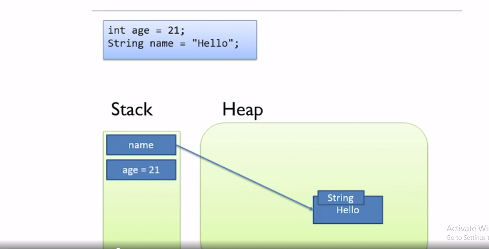

# Why memory is important in Java:

## How memory works in Java:

Java virtual machine is incredibly complicated and as Java developer we don’t need to understand exactly how it operates.

### The Stack

1. Every thread has its own stack.
2. Managed effectively by JVM.
3. Java knows exactly when data on stack can be destroyed.

### The Heap

1. Heap is used to store data that has longer lifetime than a single code block. Ex - Objects that needs to be shared across multiple methods.
2. Heap memory - All of the memory of your application except for the data on the stacks.
3. In an application there is one heap which is shared across all the threads and a number of stacks one for each thread.
4. All the threads, and in fact all code blocks in our application can potentially access the heap.
5. In Java all objects are stored on heap.
   > Note: In Java all objects are stored on the heap.

Example:

Variables are a reference to the object ( stored on stack )
Local variables are stored on the stack ( Primitive variables are entirely local ).
